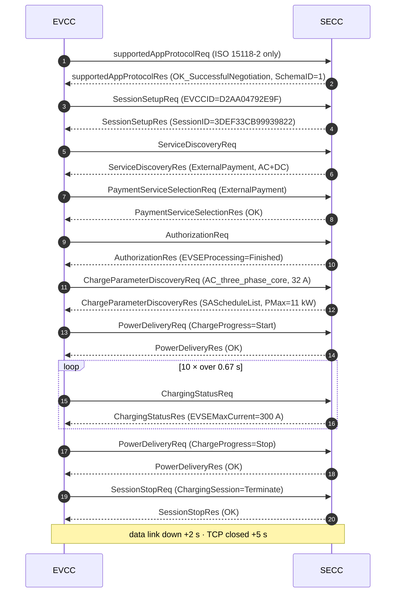

# ISO 15118-2 AC Charging Session — Analysis Report
# ISO 15118-2 交流充电会话 —— 分析报告

**Author / 作者:** Yihao
**Date / 日期:** 2026-08-23
**Stack / 协议栈:** [EcoG-io/iso15118](https://github.com/EcoG-io/iso15118) · SECC + EVCC as Docker containers
**Capture / 抓包:** [`../captures/session-01-secc.log`](../captures/session-01-secc.log) · [`../captures/session-01-evcc.log`](../captures/session-01-evcc.log)

> The template in this folder assumes a **DC** session. Mine came out **AC**, so
> sections 3 and 4 are re-cut for AC. Why that happened is section 1.
> 本目录的模板假设的是**直流**会话，我实际跑出来的是**交流**，所以第 3、4 节
> 按交流重写了。原因见第 1 节。

---

## 1. Setup / 环境

| Item | Value |
|---|---|
| SECC | `iso15118-secc-1`, simulator controller (`secc.controller.simulator`) |
| EVCC | `iso15118-evcc-1`, exited `0` after the session |
| Transport | IPv6 link-local over the Compose bridge network — peer `fe80::d0aa:4ff:fe79:2e9f` |
| Protocol negotiated | **ISO 15118-2** (`urn:iso:15118:2:2013:MsgDef`) |
| Energy transfer mode | **`AC_three_phase_core`** |
| TLS | no — plain TCP |
| Session | `3DEF33CB99939822`, 08:03:22.214 → 08:03:28.966 (≈6.8 s), 19 requests, 0 errors |

### Why ISO 15118-2 and not DIN 70121 / 为什么是 ISO 15118-2 而不是 DIN 70121

I did not choose it — **the EVCC did, by offering nothing else**:
我没有选，**是 EVCC 只报了这一个**:

```json
supportedAppProtocolReq: {
  "AppProtocol": [{ "ProtocolNamespace": "urn:iso:15118:2:2013:MsgDef",
                    "VersionNumberMajor": 2, "SchemaID": 1, "Priority": 1 }]
}
supportedAppProtocolRes: { "ResponseCode": "OK_SuccessfulNegotiation", "SchemaID": 1 }
```

The car proposes a priority-ordered menu, the station picks one and answers with
its `SchemaID`. With a single entry there was nothing to negotiate. A real EV
typically offers both DIN 70121 and ISO 15118-2 — and **most deployed DC
chargers still settle on DIN 70121**, because it shipped years earlier and the
installed base never moved.
车报一个按优先级排序的菜单，桩挑一个、用 `SchemaID` 回答。只有一个条目时无从协商。
真车通常两个都报 —— 而**已部署的直流桩大多仍然落在 DIN 70121**，因为它早几年出货，
存量设备没有跟进。

### Why the session came out AC / 为什么跑成了交流

The station advertises both modes, and the car asked for AC:
桩两种模式都支持，是车要的交流:

```
ServiceDiscoveryRes  → SupportedEnergyTransferMode: ["DC_extended", "AC_three_phase_core"]
ChargeParameterDiscoveryReq → RequestedEnergyTransferMode: "AC_three_phase_core"
```

`AC_three_phase_core` is the EVCC simulator's default. Consequence: **no
`CableCheck`, no `PreCharge`, no `WeldingDetection`** — those three exist only
to make DC safe, and section 3 explains why.
`AC_three_phase_core` 是 EVCC 模拟器的默认值。后果是**没有 `CableCheck`、
`PreCharge`、`WeldingDetection`** —— 这三个只为直流的安全而存在，原因见第 3 节。

---

## 2. Message sequence / 消息时序



---

## 3. Message-by-message walkthrough / 逐条消息解读

| # | Message | Purpose / 用途 | Observed / 观察到 |
|---|---|---|---|
| 1 | `supportedAppProtocolReq/Res` | Agree on ISO 15118-2 vs DIN 70121 | One entry only → `OK_SuccessfulNegotiation`, `SchemaID=1` |
| 2 | `SessionSetupReq/Res` | Allocate a session id | `EVCCID=D2AA04792E9F` — **the car's MAC address**. `SessionID=3DEF33CB99939822` is echoed in every later header |
| 3 | `ServiceDiscoveryReq/Res` | What the station offers | `PaymentOptionList=["ExternalPayment"]` — **Plug & Charge not offered**. `ServiceName="AC_DC_Charging"`, `FreeService=false` |
| 4 | `PaymentServiceSelectionReq/Res` | EIM (card) vs Contract (Plug & Charge) | `ExternalPayment` — the only option, so no contract certificate exchange happened |
| 5 | `AuthorizationReq/Res` | May loop while the user authenticates | `EVSEProcessing="Finished"` **on the first try** — no `Ongoing` loop. Simulator auto-authorises |
| 6 | `ChargeParameterDiscoveryReq/Res` | ⭐ Exchange power limits | Car: `EVMaxCurrent=32 A`, `EVMinCurrent=10 A`, `EAmount=60 Wh`. Station: `PMax=11 kW`, `EVSENominalVoltage=400 V`, `EVSEMaxCurrent=32 A` — **see the contradiction in §4** |
| — | ~~`CableCheckReq/Res`~~ | DC insulation test | **Absent — AC session.** No DC bus to test |
| — | ~~`PreChargeReq/Res`~~ | Match output voltage to battery | **Absent — AC session.** The onboard charger does the conversion |
| 7 | `PowerDeliveryReq/Res` (Start) | Close the contactors | `ChargeProgress="Start"`, `SAScheduleTupleID=1` — the car **accepts one specific schedule** it was offered |
| 8 | `ChargingStatusReq/Res` ×10 | The AC telemetry loop | ~67 ms apart. `ReceiptRequired=false`, `RCD=false`, `EVSENotification="None"` |
| — | ~~`CurrentDemandReq/Res`~~ | The ~250 ms DC control loop | **Absent — AC session.** `ChargingStatus` replaces it |
| 9 | `PowerDeliveryReq/Res` (Stop) | Open the contactors | `ChargeProgress="Stop"` |
| — | ~~`WeldingDetectionReq/Res`~~ | Detect a stuck contactor | **Absent — AC session.** No DC contactor to weld |
| 10 | `SessionStopReq/Res` | End the session | `ChargingSession="Terminate"` (not `Pause`) |

### Why AC skips four DC messages / 交流为什么少了四条消息

The difference is **where the AC→DC conversion happens**:
区别在于 **AC→DC 转换发生在哪里**:

```
AC 充电:  桩只是一个受控的开关 + 电表，交流电直接进车
          车载充电机 (OBC) 负责整流 → 车自己决定实际电流
          桩说 "你最多能拿这么多"，车说 "好"

DC 充电:  桩内部有整流器，直接给电池输出直流
          桩必须知道电池电压、必须先验绝缘、必须持续跟随车的电流请求
```

`CableCheck` (insulation before energising), `PreCharge` (match the output to
battery voltage before closing the contactor, or you get an arc), and
`WeldingDetection` (a DC contactor that welded shut leaves the cable live) all
exist because **the station is driving hundreds of amps of DC**. On AC none of
those hazards belong to the station.
`CableCheck`(带电前验绝缘)、`PreCharge`(合闸前把输出电压匹配到电池电压，否则拉弧)、
`WeldingDetection`(直流接触器粘连会让枪头带电)都存在，是因为**桩在直接驱动几百安的直流**。
交流下这些风险都不归桩管。

**This is the single most useful thing I learned from the session.**
**这是这次会话里我学到的最有用的一点。**

---

## 4. The control loop / 控制闭环

An AC session has no `EVTargetCurrent` — the car never tells the station a
setpoint, because the station isn't the one regulating current. What the station
publishes is a **ceiling**, and the onboard charger stays under it.
交流会话没有 `EVTargetCurrent` —— 车从不向桩下达设定值，因为调节电流的不是桩。
桩发布的是一个**上限**，车载充电机在其下自行决定。

### ⚠️ Finding: the station advertised three limits that don't agree
### ⚠️ 发现：桩报出的三个限值互相矛盾

| Where | Field | Value | Implied power (3φ, 400 V) |
|---|---|---|---|
| `ChargeParameterDiscoveryRes` → `SAScheduleList` | `PMax` | **11 000 W** | 11.0 kW |
| `ChargeParameterDiscoveryRes` → `AC_EVSEChargeParameter` | `EVSEMaxCurrent` | **32 A** | √3 × 400 × 32 ≈ **22.2 kW** |
| `ChargingStatusRes` ×10 | `EVSEMaxCurrent` | **300 A** | ≈ **208 kW** |

**A car that trusts `EVSEMaxCurrent` from `ChargingStatusRes` would draw 19× the
scheduled power.** In a real installation that trips the upstream breaker, or
worse, quietly overloads the feeder shared with the rest of the depot.
**一辆信任 `ChargingStatusRes` 里 `EVSEMaxCurrent` 的车会拉到计划功率的 19 倍。**
真实场景下这会跳上级断路器，或者更糟 —— 悄悄过载整个场站共用的进线。

**Whose bug is it?** The SECC simulator's — `300` is a hard-coded placeholder in
`secc/controller/simulator.py`, not something derived from `PMax`. It is
simulator sloppiness, not a stack defect. But it exposes a real design question:
**这是谁的 bug?** SECC 模拟器的 —— `300` 是 `secc/controller/simulator.py` 里写死的
占位值，不是从 `PMax` 推导出来的。这是模拟器的粗糙，不是协议栈缺陷。但它暴露了一个
真实的设计问题:

> ISO 15118 lets the station state a limit in **two places, in two units**, with
> no rule forcing them to agree. Reconciling them is the implementer's job, and
> nothing in the protocol catches it when you don't.
> ISO 15118 允许桩在**两个地方、用两种单位**声明限值，却没有规则强制它们一致。
> 对齐是实现者的责任，而协议本身在你没做到时不会报错。

**And the EVCC never complained** — it accepted 300 A silently through all ten
iterations. A production EVCC should clamp against the `PMax` it already agreed
to, and treat the contradiction as a fault.
**而 EVCC 从未抱怨** —— 十次循环里它都默默接受了 300 A。生产级的 EVCC 应该用它
已经接受的 `PMax` 去钳位，并把这种矛盾当作故障处理。

### Reading the Physical Value encoding / 读懂物理值编码

```json
"EVMaxCurrent": {"Multiplier": -3, "Unit": "A", "Value": 32000}
                  → 32000 × 10⁻³ = 32 A
```

Every physical quantity is `Value × 10^Multiplier` in `Unit`. **`Value` is a
16-bit signed integer** — there are no floats on the wire, which is why the
multiplier exists at all. Reading `Value` without `Multiplier` gets you 32 000 A.
每个物理量都是 `Value × 10^Multiplier` 单位为 `Unit`。**`Value` 是 16 位有符号整数** ——
线路上没有浮点数，这正是 multiplier 存在的原因。只读 `Value` 不看 `Multiplier`，
你会得到 32 000 A。

### Where the station's limit came from / 桩的限值从哪来

In this simulator: **nowhere** — both numbers are constants. In a real station
the ceiling is the minimum of four independent sources, re-evaluated
continuously:
在这个模拟器里: **哪儿也不是** —— 两个数字都是常量。真实的桩，上限是四个独立来源的
最小值，并且持续重算:

```
1. Hardware rating          机柜/整流模块的额定值           固定
2. Cable rating             通过 CP 电阻识别的枪线额定值     插枪时确定
3. Thermal derating         枪头/模块温度传感器             秒级变化
4. OCPP SetChargingProfile  后台下发的负荷管理指令           后台随时下发

EVSEMaxCurrent = min(1, 2, 3, 4)
```

**Source 4 is exactly what [project 01](../../01-ocpp-charge-point/) computes.**
`cp/profile.py::effective_limit()` resolves the OCPP profile stack into one
number; the SECC then has to fold that into the other three and republish it as
`PMax` / `EVSEMaxCurrent` here. **The charge point is the translator between the
two protocols** — and this session is the ISO 15118 half of the same limit that
`SetChargingProfile` sets on the OCPP half.
**来源 4 正是[项目 01](../../01-ocpp-charge-point/) 在算的东西。**
`cp/profile.py::effective_limit()` 把 OCPP 的 profile 栈解析成一个数字；SECC 接着要把它
和另外三个取最小，再作为这里的 `PMax` / `EVSEMaxCurrent` 重新发布。
**充电桩就是这两个协议之间的翻译器** —— 这次会话是 `SetChargingProfile` 所设限值的
ISO 15118 那一半。

---

## 5. Injected fault / 注入的故障

> **Not done yet — Day 9.** Nothing was injected into this session; it ran clean
> end to end. Writing up a fault I did not run would defeat the point of the
> report.
> **还没做 —— Day 9 的内容。** 这次会话没有注入任何故障，它从头到尾干净地跑完了。
> 编造一个没跑过的故障会让这份报告失去意义。

**Planned / 计划注入:** make the SECC answer `ChargeParameterDiscoveryRes` with
`EVSEProcessing="Ongoing"` forever, and see whether the EVCC honours the spec's
timeout or hangs.
让 SECC 在 `ChargeParameterDiscoveryRes` 里一直返回 `EVSEProcessing="Ongoing"`，
看 EVCC 是遵守规范的超时还是挂死。

---

## 6. Findings from the automated analyzer / 自动分析器的发现

> **Not run yet.** [Project 04](../../04-v2g-log-analyzer/)'s
> `parsers/v2g_text.py` is still a skeleton — it cannot read this log format.
> Feeding it these two files is what will finish that parser.
> **还没跑。**[项目 04](../../04-v2g-log-analyzer/) 的 `parsers/v2g_text.py`
> 还是骨架，读不了这个日志格式。用这两个文件去喂它，正好把那个解析器写完。

The §4 contradiction is a good first rule to encode: **compare `PMax` against
`EVSEMaxCurrent × EVSENominalVoltage × phases` and flag a mismatch.**
第 4 节的矛盾是个很好的第一条规则: **把 `PMax` 和
`EVSEMaxCurrent × EVSENominalVoltage × 相数` 对比，不一致就告警。**

---

## 7. What I would do next / 下一步

1. **Force a DC session** (`RequestedEnergyTransferMode: "DC_extended"`) and
   capture `CableCheck` / `PreCharge` / `CurrentDemand` / `WeldingDetection` — the
   four messages this AC run skipped, and the ones that actually matter for the
   bus-depot DC chargers SBRS builds.
   **强制跑一次直流会话**，抓到这次跳过的四条消息 —— 它们才是 SBRS 做的公交场站直流桩
   真正关心的。
2. **Teach `04-v2g-log-analyzer` to parse this log format** and encode the §4
   power-limit consistency check as rule `R007`.
   **让 `04-v2g-log-analyzer` 能解析这个日志格式**，并把第 4 节的功率限值一致性检查
   编成规则 `R007`。
3. **Turn on TLS and Plug & Charge.** `make build` already generated the full
   PKI — four chains: V2G Root → CPO Sub CAs → SECC cert, plus OEM, MO
   (contract certificate `UKSWI123456791A`), and CPS. Switch
   `PaymentOptionList` to include `Contract` and watch the certificate exchange.
   **打开 TLS 和 Plug & Charge。** `make build` 已经生成了完整 PKI —— 四条链。
   把 `PaymentOptionList` 改成包含 `Contract`，观察证书交换过程。
