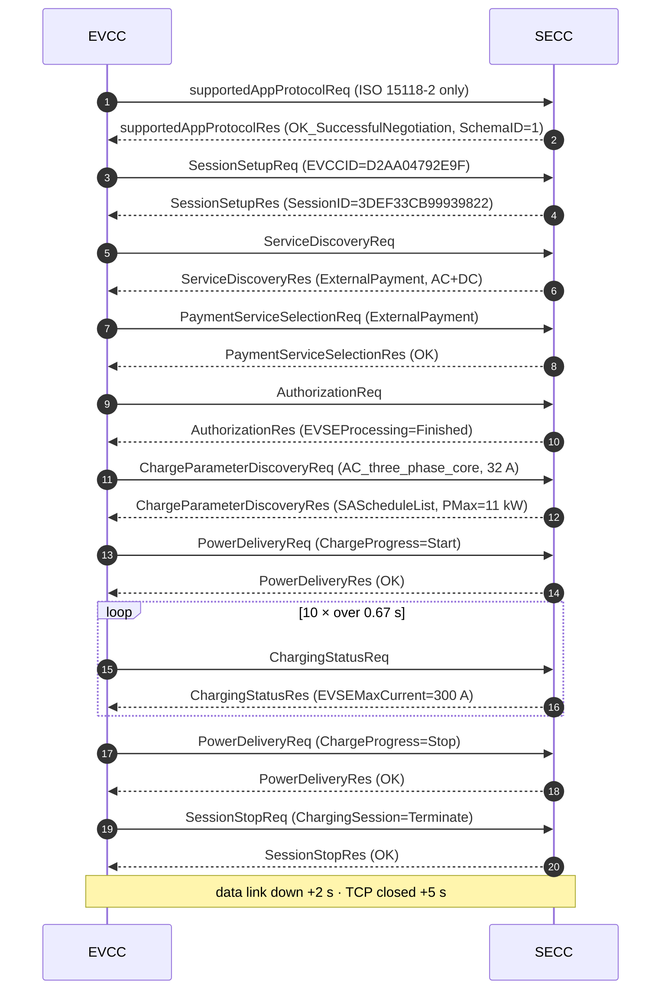

# ISO 15118-2 AC Charging Session — Analysis Report
# ISO 15118-2 交流充电会话 —— 分析报告

**Author / 作者:** Yihao
**Date / 日期:** 2026-08-23
**Stack / 协议栈:** [EcoG-io/iso15118](https://github.com/EcoG-io/iso15118) · SECC + EVCC as Docker containers
**Capture / 抓包:** [`../captures/session-01-secc.log`](../captures/session-01-secc.log) · [`../captures/session-01-evcc.log`](../captures/session-01-evcc.log)

> The template in this folder assumes a **DC** session. Mine came out **AC**, so
> sections 3 and 4 are re-cut for AC. Why that happened is section 1.
> 本目录的模板假设的是**直流**会话，我实际跑出来的是**交流**，所以第 3、4 节
> 按交流重写了。原因见第 1 节。

---

## 1. Setup / 环境

| Item | Value |
|---|---|
| SECC | `iso15118-secc-1`, simulator controller (`secc.controller.simulator`) |
| EVCC | `iso15118-evcc-1`, exited `0` after the session |
| Transport | IPv6 link-local over the Compose bridge network — peer `fe80::d0aa:4ff:fe79:2e9f` |
| Protocol negotiated | **ISO 15118-2** (`urn:iso:15118:2:2013:MsgDef`) |
| Energy transfer mode | **`AC_three_phase_core`** |
| TLS | no — plain TCP |
| Session | `3DEF33CB99939822`, 08:03:22.214 → 08:03:28.966 (≈6.8 s), 19 requests, 0 errors |

### Why ISO 15118-2 and not DIN 70121 / 为什么是 ISO 15118-2 而不是 DIN 70121

I did not choose it — **the EVCC did, by offering nothing else**:
我没有选，**是 EVCC 只报了这一个**:

```json
supportedAppProtocolReq: {
  "AppProtocol": [{ "ProtocolNamespace": "urn:iso:15118:2:2013:MsgDef",
                    "VersionNumberMajor": 2, "SchemaID": 1, "Priority": 1 }]
}
supportedAppProtocolRes: { "ResponseCode": "OK_SuccessfulNegotiation", "SchemaID": 1 }
```

The car proposes a priority-ordered menu, the station picks one and answers with
its `SchemaID`. With a single entry there was nothing to negotiate. A real EV
typically offers both DIN 70121 and ISO 15118-2 — and **most deployed DC
chargers still settle on DIN 70121**, because it shipped years earlier and the
installed base never moved.
车报一个按优先级排序的菜单，桩挑一个、用 `SchemaID` 回答。只有一个条目时无从协商。
真车通常两个都报 —— 而**已部署的直流桩大多仍然落在 DIN 70121**，因为它早几年出货，
存量设备没有跟进。

### Why the session came out AC / 为什么跑成了交流

The station advertises both modes, and the car asked for AC:
桩两种模式都支持，是车要的交流:

```
ServiceDiscoveryRes  → SupportedEnergyTransferMode: ["DC_extended", "AC_three_phase_core"]
ChargeParameterDiscoveryReq → RequestedEnergyTransferMode: "AC_three_phase_core"
```

`AC_three_phase_core` is the EVCC simulator's default. Consequence: **no
`CableCheck`, no `PreCharge`, no `WeldingDetection`** — those three exist only
to make DC safe, and section 3 explains why.
`AC_three_phase_core` 是 EVCC 模拟器的默认值。后果是**没有 `CableCheck`、
`PreCharge`、`WeldingDetection`** —— 这三个只为直流的安全而存在，原因见第 3 节。

---

## 2. Message sequence / 消息时序



---

## 3. Message-by-message walkthrough / 逐条消息解读

| # | Message | Purpose / 用途 | Observed / 观察到 |
|---|---|---|---|
| 1 | `supportedAppProtocolReq/Res` | Agree on ISO 15118-2 vs DIN 70121 | One entry only → `OK_SuccessfulNegotiation`, `SchemaID=1` |
| 2 | `SessionSetupReq/Res` | Allocate a session id | `EVCCID=D2AA04792E9F` — **the car's MAC address**. `SessionID=3DEF33CB99939822` is echoed in every later header |
| 3 | `ServiceDiscoveryReq/Res` | What the station offers | `PaymentOptionList=["ExternalPayment"]` — **Plug & Charge not offered**. `ServiceName="AC_DC_Charging"`, `FreeService=false` |
| 4 | `PaymentServiceSelectionReq/Res` | EIM (card) vs Contract (Plug & Charge) | `ExternalPayment` — the only option, so no contract certificate exchange happened |
| 5 | `AuthorizationReq/Res` | May loop while the user authenticates | `EVSEProcessing="Finished"` **on the first try** — no `Ongoing` loop. Simulator auto-authorises |
| 6 | `ChargeParameterDiscoveryReq/Res` | ⭐ Exchange power limits | Car: `EVMaxCurrent=32 A`, `EVMinCurrent=10 A`, `EAmount=60 Wh`. Station: `PMax=11 kW`, `EVSENominalVoltage=400 V`, `EVSEMaxCurrent=32 A` — **see the contradiction in §4** |
| — | ~~`CableCheckReq/Res`~~ | DC insulation test | **Absent — AC session.** No DC bus to test |
| — | ~~`PreChargeReq/Res`~~ | Match output voltage to battery | **Absent — AC session.** The onboard charger does the conversion |
| 7 | `PowerDeliveryReq/Res` (Start) | Close the contactors | `ChargeProgress="Start"`, `SAScheduleTupleID=1` — the car **accepts one specific schedule** it was offered |
| 8 | `ChargingStatusReq/Res` ×10 | The AC telemetry loop | ~67 ms apart. `ReceiptRequired=false`, `RCD=false`, `EVSENotification="None"` |
| — | ~~`CurrentDemandReq/Res`~~ | The ~250 ms DC control loop | **Absent — AC session.** `ChargingStatus` replaces it |
| 9 | `PowerDeliveryReq/Res` (Stop) | Open the contactors | `ChargeProgress="Stop"` |
| — | ~~`WeldingDetectionReq/Res`~~ | Detect a stuck contactor | **Absent — AC session.** No DC contactor to weld |
| 10 | `SessionStopReq/Res` | End the session | `ChargingSession="Terminate"` (not `Pause`) |

### Why AC skips four DC messages / 交流为什么少了四条消息

The difference is **where the AC→DC conversion happens**:
区别在于 **AC→DC 转换发生在哪里**:

```
AC 充电:  桩只是一个受控的开关 + 电表，交流电直接进车
          车载充电机 (OBC) 负责整流 → 车自己决定实际电流
          桩说 "你最多能拿这么多"，车说 "好"

DC 充电:  桩内部有整流器，直接给电池输出直流
          桩必须知道电池电压、必须先验绝缘、必须持续跟随车的电流请求
```

`CableCheck` (insulation before energising), `PreCharge` (match the output to
battery voltage before closing the contactor, or you get an arc), and
`WeldingDetection` (a DC contactor that welded shut leaves the cable live) all
exist because **the station is driving hundreds of amps of DC**. On AC none of
those hazards belong to the station.
`CableCheck`(带电前验绝缘)、`PreCharge`(合闸前把输出电压匹配到电池电压，否则拉弧)、
`WeldingDetection`(直流接触器粘连会让枪头带电)都存在，是因为**桩在直接驱动几百安的直流**。
交流下这些风险都不归桩管。

**This is the single most useful thing I learned from the session.**
**这是这次会话里我学到的最有用的一点。**

---

## 4. The control loop / 控制闭环

An AC session has no `EVTargetCurrent` — the car never tells the station a
setpoint, because the station isn't the one regulating current. What the station
publishes is a **ceiling**, and the onboard charger stays under it.
交流会话没有 `EVTargetCurrent` —— 车从不向桩下达设定值，因为调节电流的不是桩。
桩发布的是一个**上限**，车载充电机在其下自行决定。

### ⚠️ Finding: the station advertised three limits that don't agree
### ⚠️ 发现：桩报出的三个限值互相矛盾

| Where | Field | Value | Implied power (3φ, 400 V) |
|---|---|---|---|
| `ChargeParameterDiscoveryRes` → `SAScheduleList` | `PMax` | **11 000 W** | 11.0 kW |
| `ChargeParameterDiscoveryRes` → `AC_EVSEChargeParameter` | `EVSEMaxCurrent` | **32 A** | √3 × 400 × 32 ≈ **22.2 kW** |
| `ChargingStatusRes` ×10 | `EVSEMaxCurrent` | **300 A** | ≈ **208 kW** |

**A car that trusts `EVSEMaxCurrent` from `ChargingStatusRes` would draw 19× the
scheduled power.** In a real installation that trips the upstream breaker, or
worse, quietly overloads the feeder shared with the rest of the depot.
**一辆信任 `ChargingStatusRes` 里 `EVSEMaxCurrent` 的车会拉到计划功率的 19 倍。**
真实场景下这会跳上级断路器，或者更糟 —— 悄悄过载整个场站共用的进线。

**Whose bug is it?** The SECC simulator's — `300` is a hard-coded placeholder in
`secc/controller/simulator.py`, not something derived from `PMax`. It is
simulator sloppiness, not a stack defect. But it exposes a real design question:
**这是谁的 bug?** SECC 模拟器的 —— `300` 是 `secc/controller/simulator.py` 里写死的
占位值，不是从 `PMax` 推导出来的。这是模拟器的粗糙，不是协议栈缺陷。但它暴露了一个
真实的设计问题:

> ISO 15118 lets the station state a limit in **two places, in two units**, with
> no rule forcing them to agree. Reconciling them is the implementer's job, and
> nothing in the protocol catches it when you don't.
> ISO 15118 允许桩在**两个地方、用两种单位**声明限值，却没有规则强制它们一致。
> 对齐是实现者的责任，而协议本身在你没做到时不会报错。

**And the EVCC never complained** — it accepted 300 A silently through all ten
iterations. A production EVCC should clamp against the `PMax` it already agreed
to, and treat the contradiction as a fault.
**而 EVCC 从未抱怨** —— 十次循环里它都默默接受了 300 A。生产级的 EVCC 应该用它
已经接受的 `PMax` 去钳位，并把这种矛盾当作故障处理。

That was an observation, not yet a conclusion — accepting a limit that is too
high proves only that nothing rejected it. **§5** tests it from the other side,
dropping the station's offer *below* what the car said it needs, and confirms
the EVCC does not read the field at all.
这只是观察，还不是结论 —— 接受一个过高的限值，只能说明没人拒绝它。
**第 5 节**从另一头验证：把桩的报价压到**低于**车声明的需求，
确认了 EVCC 根本不读这个字段。

### Reading the Physical Value encoding / 读懂物理值编码

```json
"EVMaxCurrent": {"Multiplier": -3, "Unit": "A", "Value": 32000}
                  → 32000 × 10⁻³ = 32 A
```

Every physical quantity is `Value × 10^Multiplier` in `Unit`. **`Value` is a
16-bit signed integer** — there are no floats on the wire, which is why the
multiplier exists at all. Reading `Value` without `Multiplier` gets you 32 000 A.
每个物理量都是 `Value × 10^Multiplier` 单位为 `Unit`。**`Value` 是 16 位有符号整数** ——
线路上没有浮点数，这正是 multiplier 存在的原因。只读 `Value` 不看 `Multiplier`，
你会得到 32 000 A。

### Where the station's limit came from / 桩的限值从哪来

In this simulator: **nowhere** — both numbers are constants. In a real station
the ceiling is the minimum of four independent sources, re-evaluated
continuously:
在这个模拟器里: **哪儿也不是** —— 两个数字都是常量。真实的桩，上限是四个独立来源的
最小值，并且持续重算:

```
1. Hardware rating          机柜/整流模块的额定值           固定
2. Cable rating             通过 CP 电阻识别的枪线额定值     插枪时确定
3. Thermal derating         枪头/模块温度传感器             秒级变化
4. OCPP SetChargingProfile  后台下发的负荷管理指令           后台随时下发

EVSEMaxCurrent = min(1, 2, 3, 4)
```

**Source 4 is exactly what [project 01](../../01-ocpp-charge-point/) computes.**
`cp/profile.py::effective_limit()` resolves the OCPP profile stack into one
number; the SECC then has to fold that into the other three and republish it as
`PMax` / `EVSEMaxCurrent` here. **The charge point is the translator between the
two protocols** — and this session is the ISO 15118 half of the same limit that
`SetChargingProfile` sets on the OCPP half.
**来源 4 正是[项目 01](../../01-ocpp-charge-point/) 在算的东西。**
`cp/profile.py::effective_limit()` 把 OCPP 的 profile 栈解析成一个数字；SECC 接着要把它
和另外三个取最小，再作为这里的 `PMax` / `EVSEMaxCurrent` 重新发布。
**充电桩就是这两个协议之间的翻译器** —— 这次会话是 `SetChargingProfile` 所设限值的
ISO 15118 那一半。

---

## 5. Injected fault / 注入的故障

**Capture:** [`../captures/session-03-fault.pcap`](../captures/session-03-fault.pcap) ·
[`session-03-fault-secc.log`](../captures/session-03-fault-secc.log) ·
[`session-03-fault-evcc.log`](../captures/session-03-fault-evcc.log)
**Reproduce:** [`setup/faults/01-current-below-ev-minimum.sh`](../setup/faults/01-current-below-ev-minimum.sh)

### What I broke / 我改坏了什么

§4 found the station advertising three power limits that disagree, and noted the
EVCC accepted 300 A without complaint ten times over. That was an observation.
This is the experiment that turns it into a finding.
第 4 节发现桩报出三个互相矛盾的功率限值，而 EVCC 十次循环里都默默接受了 300 A。
那只是观察。这个实验把它变成结论。

One line in the SECC simulator, one variable:

```diff
  # get_ac_charge_params_v2() — the AC_EVSEChargeParameter in ChargeParameterDiscoveryRes
  evse_max_current = PVEVSEMaxCurrent(
-     multiplier=0, value=32, unit=UnitSymbol.AMPERE
+     multiplier=0, value=5, unit=UnitSymbol.AMPERE
  )
```

`EVSENominalVoltage` (400 V) and the `SAScheduleList` `PMax` (11 kW) are left
untouched, so exactly one thing changed. The car had asked for
`EVMinCurrent = 10 A`; the station now offers **half of that**.
`EVSENominalVoltage`(400 V) 和 `SAScheduleList` 的 `PMax`(11 kW) 都不动，
保证只有一个变量。车报的 `EVMinCurrent` 是 10 A，桩现在只给它的一半。

The patch is bind-mounted over the installed module, so the upstream repo is
never modified and reverting is `rm` plus a restart.
补丁以挂载方式覆盖已安装的模块，上游仓库一个字节都没改，撤销只需 rm 加重启。

### Expected behaviour / 预期行为

`EVMinCurrent` exists precisely so the station knows the floor below which the
onboard charger cannot regulate. Offered 5 A against a stated minimum of 10 A,
a correct EVCC should refuse — `PowerDeliveryReq(Stop)` or `SessionStopReq`,
not `Start`.
`EVMinCurrent` 存在的意义就是告诉桩"低于这个值车载充电机没法调节"。
被给了 5 A 而自己声明最低 10 A，正确的 EVCC 应该拒绝 —— 发
`PowerDeliveryReq(Stop)` 或 `SessionStopReq`，而不是 `Start`。

### Observed behaviour / 实际行为

Nothing changed. Not "handled badly" — **not read at all**.
什么都没变。不是"处理得不好" —— 是**根本没读**。

| | session-02 (healthy) | session-03 (fault) |
|---|---|---|
| Station's `EVSEMaxCurrent` | **32 A** | **5 A** |
| Car's `ChargingProfileEntryMaxPower` | 11 000 W | **11 000 W** |
| V2GTP messages | 38 | **38** |
| Byte length of every message | — | **identical, all 38** |
| Charging loop | 10 × `ChargingStatus` | **10 × `ChargingStatus`** |
| EVCC exit code | 0 | **0** |
| Errors / warnings in either log | 0 | **0** |

The car declared it would draw **11 kW against a 5 A offer** — 5 A at
three-phase 400 V is ≈3.46 kW, so **3.2× over**. Both ends then ran a textbook
session to `SessionStop`.
车宣称要拉 **11 kW，而桩只给了 5 A** —— 三相 400 V 下 5 A ≈ 3.46 kW，**超了 3.2 倍**。
之后双方跑完了一次教科书般的会话，直到 `SessionStop`。

### Root cause chain / 根因链

```
Symptom          Station can supply 3.46 kW, car requests 11 kW,
现象             and both consider the session successful.

First anomalous  ChargeParameterDiscoveryRes
frame              AC_EVSEChargeParameter.EVSEMaxCurrent = 5 A   ← injected
第一帧异常报文      SAScheduleList.PMax                  = 11 000 W (untouched)

The field at     No single field is malformed. Two fields contradict each
fault              other, and ISO 15118-2 states no precedence between them.
出错的字段         没有哪个字段是坏的 —— 是两个字段互相矛盾，而规范没有规定谁优先。

Why the peer     The EVCC builds its ChargingProfile from PMax alone. It never
reacted that       reads AC_EVSEChargeParameter.EVSEMaxCurrent, so it copies
way                11 000 W straight through — and therefore can never notice
对端为什么那样反应   that 5 A is below its own EVMinCurrent of 10 A.
                   Proof: the ChargingProfile is byte-identical to session-02's.

What a real      1. Station: derive both limits from one source —
station should      EVSEMaxCurrent = PMax / (√3 × EVSENominalVoltage) — or the
do instead          ambiguity is permanent.
真桩应该怎么做     2. Car: clamp to min(PMax, EVSEMaxCurrent × U × √3), and if the
                    result falls below EVMinCurrent, send SessionStop rather
                    than starting to charge.
                 3. Both: treat the contradiction as a session-terminating
                    fault, not something to continue silently through.
```

### The byte the fault lives in / 故障所在的那个字节

Diffing message #12 (`ChargeParameterDiscoveryRes`, 325 bytes) across the two
captures gives **75 differing bytes** — but only one of them is the fault:
把两次抓包的第 12 条消息按字节对比，**75 个字节不同** —— 但只有一个是故障:

| Offset | Bytes | What it is |
|---|---|---|
| 3 – 11 | 9 | `SessionID` — different every session, noise |
| 219 – 283 | 65 | The `SalesTariff` signature (`Signature_isUsed=1`; an ECDSA P-256 signature is 64 bytes) — different every session, noise |
| **323** | **1** | **the injected value** |

```
session-02:  0x80 = 1000 0000        32 << 2 = 128 = 0x80   ✅
session-03:  0x14 = 0001 0100         5 << 2 =  20 = 0x14   ✅
```

The field sits at a 2-bit offset — EXI does not align values to byte
boundaries — so the value appears shifted left by two.
字段落在 2 位偏移上 —— EXI 不把值对齐到字节边界 —— 所以数值看起来左移了两位。

### Method note: do not diff EXI / 方法论：别对 EXI 做字节 diff

Signal-to-noise here is **1 : 74**. SessionID and a per-session signature swamp
the one byte that matters, and without already knowing the answer the diff is
useless. Anything signed or session-keyed has to be decoded to the field level
before comparison — which is why protocol-aware tooling exists and a generic
packet differ cannot replace it.
这里的信噪比是 **1 : 74**。SessionID 和每次不同的签名淹没了唯一有意义的那个字节，
事先不知道答案的话，diff 毫无用处。凡是带签名或带会话密钥的协议，
都必须先解码到字段层面再比较 —— 这正是协议感知工具存在的理由，
通用抓包工具替代不了。

### Why this one matters / 为什么这个故障值得记

On AC the station does not regulate current; it publishes a ceiling and trusts
the onboard charger to stay under it. A car that never reads that ceiling turns
the station's limit into a suggestion, and the only remaining protection is the
upstream breaker. In a depot where twenty chargers share one feeder, that is not
a theoretical concern.
交流充电下桩不控制电流，它只发布一个上限，指望车载充电机自觉。一辆从不读这个
上限的车，把桩的限值变成了建议 —— 剩下的唯一保护就是上级断路器。
在二十把枪共用一路进线的场站里，这不是理论问题。
---

## 6. Findings from the automated analyzer / 自动分析器的发现

[Project 04](../../04-v2g-log-analyzer/) can read these logs now. Its
`parsers/v2g_text.py` targets the `exi_codec` lines rather than the shorter
`comm_session` ones, because only those carry the decoded payload — and the
payload is what a rule needs to compare two fields against each other.
[项目 04](../../04-v2g-log-analyzer/) 现在能读这些日志了。解析器盯的是
`exi_codec` 那两行而不是更短的 `comm_session` 行，因为只有它们带解码后的载荷 ——
而载荷正是"拿两个字段互相比对"这类规则需要的东西。

```bash
$ python -m v2ganalyzer samples/v2g_session_fault.log --format md
```

| Metric | Value |
|---|---|
| Frames parsed | 38 |
| Requests | 19 |
| Duration | 1.8 s |
| Errors | **1** |
| Warnings | 0 |

| Rule | Severity | Line | Message |
|---|---|---|---|
| R007 | error | 75 | station advertises PMax=11000 W but EVSEMaxCurrent=5 A at 400 V implies 3464 W |

### R007, and why it fires on the healthy session too / R007，以及它为什么在正常会话上也报警

The rule encodes §4's contradiction: compare the `PMax` in the `SAScheduleList`
against `EVSEMaxCurrent × EVSENominalVoltage × √3`, and flag a relative
difference above 10 %. The phase factor comes from the *request*
(`RequestedEnergyTransferMode`) and the limits from the *response*, so no single
log line can express it — which is the whole reason a session-level analyzer
exists.
规则把第 4 节的矛盾编码了下来: 把 `SAScheduleList` 里的 `PMax` 和
`EVSEMaxCurrent × EVSENominalVoltage × √3` 对比，相对差超过 10% 就告警。
相数来自**请求**里的 `RequestedEnergyTransferMode`，限值来自**响应** ——
任何单独一行日志都表达不了，这正是会话级分析器存在的理由。

| Log | `PMax` | `EVSEMaxCurrent` | implied | difference | flagged |
|---|---|---|---|---|---|
| `v2g_session.log` (healthy) | 11 000 W | 32 A | 22 170 W | 50.4 % | ✅ |
| `v2g_session_fault.log` | 11 000 W | 5 A | 3 464 W | 68.5 % | ✅ |
| synthetic, consistent | 22 170 W | 32 A | 22 170 W | 0 % | — |

**The healthy session is flagged on purpose.** The contradiction predates the
injected fault — the station has been advertising two incompatible ceilings
since [`session-01`](../captures/session-01-secc.log). A rule that fired only on
the broken log would have been fitted to that log rather than derived from the
protocol, so the healthy capture is kept as a test case precisely to prevent
that.
**正常会话被告警是刻意的。** 那个矛盾在注入故障之前就存在 —— 从
[`session-01`](../captures/session-01-secc.log) 起，桩报的就是两个互不兼容的上限。
一条只在故障日志上报警的规则，说明它是照着那份日志凑出来的、而不是从协议推导出来的，
所以正常抓包被专门留作测试用例来防止这件事。

### What the rule deliberately does not decide / 规则刻意不做的判断

It reports that the two disagree, not which one is right — only the station
knows whether its hardware can really deliver 32 A or only 11 kW. It also does
not distinguish the two directions, though they differ in consequence: a
schedule *above* the electrical rating means the car will over-draw and trip the
breaker, while one *below* it merely wastes capacity. Both are configuration
defects, and today's direction is no guarantee of tomorrow's.
它只报告两者不一致，不判断谁对 —— 只有桩自己知道硬件到底能给 32 A 还是只能给 11 kW。
它也不区分两个方向，尽管后果不同: 计划**高于**电气额定值意味着车会超拉、跳断路器，
**低于**则只是浪费容量。两者都是配置缺陷，而且今天的方向不保证明天不变。

### Known limitation / 已知限制

The parser drops the `V2G_Message` `Header`, so `SessionID` is not kept and one
file is assumed to hold one session. `session-02-secc.log` actually contains
two runs, and correlating across them would pair a request from one session with
a response from the other. Keying `uid` on `SessionID:MessageName` would fix it.
解析器丢掉了 `V2G_Message` 的 `Header`，所以 `SessionID` 没有保留，
默认一个文件只有一次会话。`session-02-secc.log` 实际含两次运行，跨会话配对会把
一次会话的请求和另一次的响应配到一起。把 `uid` 改成 `SessionID:消息名` 即可修复。
---

## 7. Extending ISO 15118 without breaking it / 在不破坏 ISO 15118 的前提下扩展它

A bus depot needs four things OCPP and ISO 15118 both lack: which bay a vehicle
is in, which vehicle it is, when it has to leave, and what charge it needs by
then. Neither protocol should carry them. The departure time comes from the
operator's scheduling system rather than from the charger, and a standard used
by hundreds of millions of passenger cars has no business defining a field that
a few thousand depots need.
公交场站需要四样 OCPP 和 ISO 15118 都没有的东西: 车位号、车辆编号、发车时间、
目标电量。两个协议都不该带它们。发车时间来自运营方的排班系统而不是充电桩，
而一个服务几亿辆乘用车的标准，不该为几千个场站定义字段。

The two protocols answer this differently, and the difference is the whole
point of implementing both.
两个协议给出了不同的答案，而这个差别正是两边都做一遍的意义所在。

### ISO 15118 cannot take a new field at all / ISO 15118 根本加不了字段

The XSD is normative and EXI is schema-informed. A field is not a name on the
wire, it is a position: the decoder knows to read two bits here and eight there
because the grammar generated from the XSD says so. Insert one element and every
subsequent bit shifts, so the peer does not "ignore the unknown field" the way a
JSON parser would — it decodes garbage from that bit onward, for this message and
every one after it.
XSD 是规范性的，EXI 又是 schema-informed。字段在线路上不是一个名字，是一个位置:
解码器知道这里读 2 位、那里读 8 位，是因为从 XSD 生成的语法这么写。插入一个元素，
之后每一位都错位 —— 对端不会像 JSON 解析器那样"忽略不认识的字段"，
而是从那一位起解出乱码，这条消息以及之后所有消息都是。

The sanctioned route is a value-added service, and the standard reserved the
slot itself:
官方路线是增值服务，而且标准自己留好了槽:

```python
# iso15118/shared/messages/iso15118_2/datatypes.py
class ServiceCategory(str, Enum):
    CUSTOM = "OtherCustom"          # ← the depot lives here
class ServiceName(str, Enum):
    CUSTOM = "UseCaseInformation"
```

Nothing about this is a workaround. ISO 15118-2 anticipated exactly this case.
这里没有任何取巧。ISO 15118-2 早就预见到了这种用法。

### What it looks like on the wire / 线路上的样子

Three steps, reproducible with
[`setup/vas/00-enable-tls.sh`](../setup/vas/00-enable-tls.sh) and
[`01-depot-service.sh`](../setup/vas/01-depot-service.sh), captured in
[`session-05-vas`](../captures/session-05-vas.pcap):

```json
ServiceDiscoveryRes   "ServiceList": {"Service": [
                          {"ServiceID": 2, "ServiceName": "Certificate", ...},
                          {"ServiceID": 4, "ServiceName": "UseCaseInformation",
                           "ServiceCategory": "OtherCustom", "FreeService": true}]}

ServiceDetailReq      {"ServiceID": 4}

ServiceDetailRes      "ServiceParameterList": {"ParameterSet": [{"ParameterSetID": 1,
                          "Parameter": [{"Name": "DepotSlot", "intValue": 7},
                                        {"Name": "BusId",     "stringValue": "EB123"},
                                        {"Name": "DepartAt",  "stringValue": "06:35"},
                                        {"Name": "TargetSoc", "byteValue": 90}]}]}
```

**Discovery first, details on request.** The car cannot guess a ServiceID: the
station builds its list at runtime — TLS off means no list at all — and
[V2G2-425] requires the SECC to answer `FAILED_ServiceIDInvalid` for an ID it
never offered. Probing is not merely futile, it is specified as an error.
**先发现，再按需取详情。** 车猜不出 ServiceID: 服务列表是桩运行时构造的（不开 TLS
就根本没有），而 [V2G2-425] 要求桩对没提供过的 ID 回 `FAILED_ServiceIDInvalid`。
试探不只是徒劳，是被规定为错误。

### Against the OCPP answer / 对照 OCPP 的答案

The same four fields go over OCPP's `DataTransfer`
([project 01](../../01-ocpp-charge-point/)):

| | OCPP `DataTransfer` | ISO 15118 `ParameterSet` |
|---|---|---|
| On the wire | `"data": "{\"slot\": 7, ...}"` | `{"Name":"DepotSlot","intValue":7}` |
| Typing | none — JSON inside JSON | `intValue` / `stringValue` / `byteValue` |
| Peer can validate | ❌ | ✅ the XSD does it |
| Peer can discover | ❌ agree the vendorId out of band | ✅ `ServiceDiscovery` lists it |
| TLS required | ❌ | ✅ [V2G2-422] |
| Namespace | reverse-DNS `vendorId` | `ServiceID` + `OtherCustom` |
| Refusal | four status codes | `FAILED_ServiceIDInvalid` |

The trade is the same one that separates the two protocols everywhere else.
OCPP connects a station to a backend that usually belongs to the same company or
a contracted partner, so an opaque blob both sides agreed on privately costs
nothing. ISO 15118 connects any car to any station, parties that have never
spoken, so an extension has to be announced, typed, and safely ignorable — and
that is worth the six value types and the mandatory TLS.
这个取舍和两个协议在别处的分歧是同一个。OCPP 连接的桩和后台通常同属一家公司或有
合同关系，所以一个双方私下约定的不透明字符串没什么代价。ISO 15118 连接的是任意车
和任意桩 —— 两个素未谋面的参与方 —— 所以扩展必须能被告知、有类型、且能被安全忽略，
这才值得付出"只有六种类型"和"强制 TLS"的代价。

---

## 8. What I would do next / 下一步

1. **Force a DC session** (`RequestedEnergyTransferMode: "DC_extended"`) and
   capture `CableCheck` / `PreCharge` / `CurrentDemand` / `WeldingDetection` — the
   four messages this AC run skipped, and the ones that actually matter for the
   bus-depot DC chargers SBRS builds.
   **强制跑一次直流会话**，抓到这次跳过的四条消息 —— 它们才是 SBRS 做的公交场站直流桩
   真正关心的。
2. **Teach `04-v2g-log-analyzer` to parse this log format** and encode the §4
   power-limit consistency check as rule `R007`.
   **让 `04-v2g-log-analyzer` 能解析这个日志格式**，并把第 4 节的功率限值一致性检查
   编成规则 `R007`。
3. **Turn on TLS and Plug & Charge.** `make build` already generated the full
   PKI — four chains: V2G Root → CPO Sub CAs → SECC cert, plus OEM, MO
   (contract certificate `UKSWI123456791A`), and CPS. Switch
   `PaymentOptionList` to include `Contract` and watch the certificate exchange.
   **打开 TLS 和 Plug & Charge。** `make build` 已经生成了完整 PKI —— 四条链。
   把 `PaymentOptionList` 改成包含 `Contract`，观察证书交换过程。
