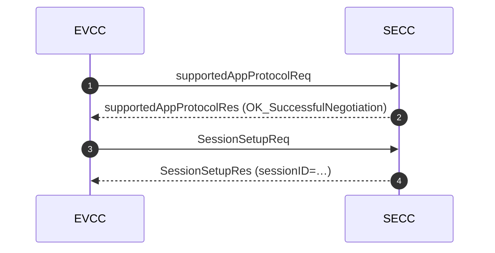

# ISO 15118-2 DC Charging Session — Analysis Report
# ISO 15118-2 直流充电会话 —— 分析报告

> Fill this in from a session you actually ran. Delete every prompt in
> `> quotes` as you go. The finished file is your interview artefact.
> 用你真正跑过的会话来填。填完把所有 `> 引用` 提示删掉。
> 完成后的文件就是你的面试作品。

**Author / 作者:**
**Date / 日期:**
**Stack / 协议栈:** EcoG-io/iso15118 vX.Y  ·  SECC + EVCC on `veth` pair
**Capture / 抓包:** `../captures/session-01.pcap`

---

## 1. Setup / 环境

| Item | Value |
|---|---|
| SECC | |
| EVCC | |
| Transport | IPv6 link-local over `veth-secc` / `veth-evcc` |
| Protocol negotiated | ISO 15118-2 / DIN SPEC 70121 |
| TLS | yes / no |

> Say why you chose the protocol you did. If the stack fell back to
> DIN 70121, that IS the interesting finding — most deployed DC chargers do.
> 说明你为什么选这个协议。如果协议栈回退到了 DIN 70121，那本身就是有意思的发现 ——
> 大多数已部署的直流桩都是这样。

---

## 2. Message sequence / 消息时序

> Paste the Mermaid diagram generated by project 04:
> 粘贴项目 04 生成的 Mermaid 图:
> `python -m v2ganalyzer <log> --format mermaid`

---

## 3. Message-by-message walkthrough / 逐条消息解读

> For each message: what it is FOR, the two or three fields that matter, and
> what you observed. Do not paraphrase the standard — say what YOUR session did.
> 每条消息写: 它的**用途**、两三个关键字段、以及你**观察到**了什么。
> 不要复述标准 —— 写你自己的会话到底发生了什么。

| # | Message | Purpose / 用途 | Key fields observed / 观察到的关键字段 |
|---|---|---|---|
| 1 | `supportedAppProtocolReq` | Agree on ISO 15118-2 vs DIN 70121 | |
| 2 | `SessionSetupReq/Res` | Allocate a session id | |
| 3 | `ServiceDiscoveryReq/Res` | What services does the station offer | |
| 4 | `PaymentServiceSelectionReq/Res` | EIM (card) vs Contract (Plug & Charge) | |
| 5 | `AuthorizationReq/Res` | May loop while the user authenticates | |
| 6 | `ChargeParameterDiscoveryReq/Res` | ⭐ Exchange battery + station power limits | |
| 7 | `CableCheckReq/Res` | DC insulation test before closing contactors | |
| 8 | `PreChargeReq/Res` | Match output voltage to battery voltage | |
| 9 | `PowerDeliveryReq/Res` (Start) | Close the contactors | |
| 10 | `CurrentDemandReq/Res` ×N | ⭐ The ~250 ms control loop | |
| 11 | `PowerDeliveryReq/Res` (Stop) | | |
| 12 | `WeldingDetectionReq/Res` | Detect a stuck contactor | |
| 13 | `SessionStopReq/Res` | | |

---

## 4. The control loop / 控制闭环

> This section is the one that will get you the job. Plot
> `EVTargetCurrent` (what the car asked) against `EVSEMaximumCurrentLimit`
> (what the station allowed) over the whole session, and explain every gap.
> 这一节是能帮你拿下 offer 的部分。把整个会话中 `EVTargetCurrent`(车请求)
> 与 `EVSEMaximumCurrentLimit`(桩允许) 画在一起，并解释每一处差值。

| t (s) | EVTargetCurrent (A) | EVSEMaximumCurrentLimit (A) | Delivered (A) | Why the gap |
|---|---|---|---|---|
| | | | | |

**Where the station's limit came from / 桩的限值从哪来:**

> Trace it backwards: hardware rating → cable rating (via the CP resistor) →
> thermal derating → OCPP `SetChargingProfile` from the backend.
> Naming all four sources is what separates a candidate who read a blog post
> from one who thought about the system.
> 反向追溯: 硬件额定值 → 线缆额定值(经 CP 电阻识别) → 温度降额 →
> 后台下发的 OCPP `SetChargingProfile`。能说全这四个来源，就区分开了
> "读过博客的候选人"和"想过整个系统的候选人"。

---

## 5. Injected fault / 注入的故障

**What I broke / 我改坏了什么:**

**Expected behaviour / 预期行为:**

**Observed behaviour / 实际行为:**

**Root cause chain / 根因链:**

> Write it as a chain, not a sentence:
> symptom → first anomalous frame → the field that was wrong → why the peer
> reacted that way → what a real station should do instead.
> 写成一条链而不是一句话:
> 现象 → 第一帧异常报文 → 出错的字段 → 对端为什么那样反应 → 真实的桩应该怎么做。

---

## 6. Findings from the automated analyzer / 自动分析器的发现

> `python -m v2ganalyzer <log> --format md`  — paste the findings table.

---

## 7. What I would do next / 下一步

> Three concrete items. "Learn more" is not an item.
> 三条具体的事。"继续学习"不算一条。

1.
2.
3.
