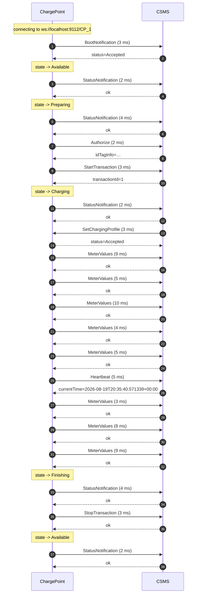

# Session report — `samples/ocpp_session.log`

## Summary / 摘要

| Metric | Value |
|---|---|
| Frames parsed / 解析帧数 | 44 |
| Requests / 请求数 | 19 |
| Duration / 时长 | 41.1 s |
| Errors / 错误 | 0 |
| Warnings / 警告 | 0 |

## Findings / 问题清单

_No anomalies detected. 未发现异常。_

## Timeline / 时间线

| # | Time | Dir | Message | Latency |
|---|---|---|---|---|
| 2 | +  0.02s | -> | BootNotification | 3 ms |
| 3 | +  0.02s | <- | CALLRESULT |  |
| 5 | +  0.02s | -> | StatusNotification | 2 ms |
| 6 | +  0.02s | <- | CALLRESULT |  |
| 8 | +  1.03s | -> | StatusNotification | 4 ms |
| 9 | +  1.03s | <- | CALLRESULT |  |
| 10 | +  1.03s | -> | Authorize | 2 ms |
| 11 | +  1.03s | <- | CALLRESULT |  |
| 12 | +  1.04s | -> | StartTransaction | 3 ms |
| 13 | +  1.04s | <- | CALLRESULT |  |
| 15 | +  1.04s | -> | StatusNotification | 2 ms |
| 16 | +  1.04s | <- | CALLRESULT |  |
| 17 | +  4.02s | <- | SetChargingProfile | 3 ms |
| 18 | +  4.03s | -> | CALLRESULT |  |
| 19 | +  5.02s | -> | MeterValues | 9 ms |
| 20 | +  5.03s | <- | CALLRESULT |  |
| 21 | + 10.04s | -> | MeterValues | 5 ms |
| 22 | + 10.04s | <- | CALLRESULT |  |
| 23 | + 15.05s | -> | MeterValues | 10 ms |
| 24 | + 15.06s | <- | CALLRESULT |  |
| 25 | + 20.06s | -> | MeterValues | 4 ms |
| 26 | + 20.07s | <- | CALLRESULT |  |
| 27 | + 25.07s | -> | MeterValues | 5 ms |
| 28 | + 25.08s | <- | CALLRESULT |  |
| 29 | + 30.02s | -> | Heartbeat | 5 ms |
| 30 | + 30.03s | <- | CALLRESULT |  |
| 31 | + 30.08s | -> | MeterValues | 3 ms |
| 32 | + 30.09s | <- | CALLRESULT |  |
| 33 | + 35.09s | -> | MeterValues | 8 ms |
| 34 | + 35.10s | <- | CALLRESULT |  |
| 35 | + 40.11s | -> | MeterValues | 9 ms |
| 36 | + 40.12s | <- | CALLRESULT |  |
| 38 | + 41.05s | -> | StatusNotification | 4 ms |
| 39 | + 41.05s | <- | CALLRESULT |  |
| 40 | + 41.05s | -> | StopTransaction | 3 ms |
| 41 | + 41.06s | <- | CALLRESULT |  |
| 43 | + 41.06s | -> | StatusNotification | 2 ms |
| 44 | + 41.06s | <- | CALLRESULT |  |

## Sequence diagram / 时序图

