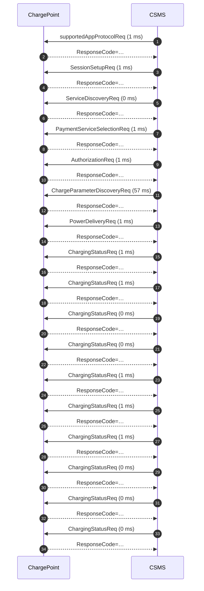

# Session report — `samples/v2g_session_truncated.log`

## Summary / 摘要

| Metric | Value |
|---|---|
| Frames parsed / 解析帧数 | 34 |
| Requests / 请求数 | 17 |
| Duration / 时长 | 1.5 s |
| Errors / 错误 | 2 |
| Warnings / 警告 | 0 |

## Findings / 问题清单

| Rule | Severity | Line | Message |
|---|---|---|---|
| R007 | error | 75 | station advertises PMax=11000 W but EVSEMaxCurrent=32 A at 400 V implies 22170 W |
| R008 | error | 136 | session reached ChargingStatus but never sent SessionStop — log ends at ChargingStatusReq |

## Timeline / 时间线

| # | Time | Dir | Message | Latency |
|---|---|---|---|---|
| 1 | +  0.00s | <- | supportedAppProtocolReq | 1 ms |
| 2 | +  0.00s | -> | supportedAppProtocolRes |  |
| 3 | +  0.18s | <- | SessionSetupReq | 1 ms |
| 4 | +  0.18s | -> | SessionSetupRes |  |
| 5 | +  0.31s | <- | ServiceDiscoveryReq | 0 ms |
| 6 | +  0.31s | -> | ServiceDiscoveryRes |  |
| 7 | +  0.43s | <- | PaymentServiceSelectionReq | 1 ms |
| 8 | +  0.43s | -> | PaymentServiceSelectionRes |  |
| 9 | +  0.53s | <- | AuthorizationReq | 1 ms |
| 10 | +  0.53s | -> | AuthorizationRes |  |
| 11 | +  0.62s | <- | ChargeParameterDiscoveryReq | 57 ms |
| 12 | +  0.68s | -> | ChargeParameterDiscoveryRes |  |
| 13 | +  0.78s | <- | PowerDeliveryReq | 1 ms |
| 14 | +  0.78s | -> | PowerDeliveryRes |  |
| 15 | +  0.86s | <- | ChargingStatusReq | 1 ms |
| 16 | +  0.86s | -> | ChargingStatusRes |  |
| 17 | +  0.94s | <- | ChargingStatusReq | 1 ms |
| 18 | +  0.94s | -> | ChargingStatusRes |  |
| 19 | +  1.03s | <- | ChargingStatusReq | 0 ms |
| 20 | +  1.03s | -> | ChargingStatusRes |  |
| 21 | +  1.11s | <- | ChargingStatusReq | 0 ms |
| 22 | +  1.11s | -> | ChargingStatusRes |  |
| 23 | +  1.19s | <- | ChargingStatusReq | 1 ms |
| 24 | +  1.19s | -> | ChargingStatusRes |  |
| 25 | +  1.25s | <- | ChargingStatusReq | 1 ms |
| 26 | +  1.26s | -> | ChargingStatusRes |  |
| 27 | +  1.33s | <- | ChargingStatusReq | 1 ms |
| 28 | +  1.33s | -> | ChargingStatusRes |  |
| 29 | +  1.39s | <- | ChargingStatusReq | 0 ms |
| 30 | +  1.39s | -> | ChargingStatusRes |  |
| 31 | +  1.46s | <- | ChargingStatusReq | 0 ms |
| 32 | +  1.46s | -> | ChargingStatusRes |  |
| 33 | +  1.53s | <- | ChargingStatusReq | 0 ms |
| 34 | +  1.53s | -> | ChargingStatusRes |  |

## Sequence diagram / 时序图

