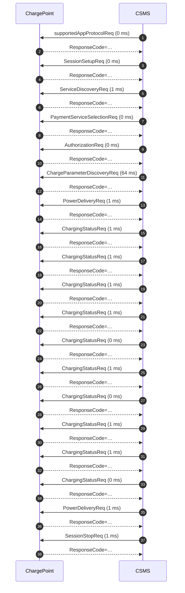

# Session report — `samples/v2g_session_fault.log`

## Summary / 摘要

| Metric | Value |
|---|---|
| Frames parsed / 解析帧数 | 38 |
| Requests / 请求数 | 19 |
| Duration / 时长 | 1.8 s |
| Errors / 错误 | 1 |
| Warnings / 警告 | 0 |

## Findings / 问题清单

| Rule | Severity | Line | Message |
|---|---|---|---|
| R007 | error | 75 | station advertises PMax=11000 W but EVSEMaxCurrent=5 A at 400 V implies 3464 W |

## Timeline / 时间线

| # | Time | Dir | Message | Latency |
|---|---|---|---|---|
| 1 | +  0.00s | <- | supportedAppProtocolReq | 0 ms |
| 2 | +  0.00s | -> | supportedAppProtocolRes |  |
| 3 | +  0.17s | <- | SessionSetupReq | 0 ms |
| 4 | +  0.17s | -> | SessionSetupRes |  |
| 5 | +  0.30s | <- | ServiceDiscoveryReq | 1 ms |
| 6 | +  0.30s | -> | ServiceDiscoveryRes |  |
| 7 | +  0.41s | <- | PaymentServiceSelectionReq | 0 ms |
| 8 | +  0.41s | -> | PaymentServiceSelectionRes |  |
| 9 | +  0.53s | <- | AuthorizationReq | 0 ms |
| 10 | +  0.53s | -> | AuthorizationRes |  |
| 11 | +  0.62s | <- | ChargeParameterDiscoveryReq | 64 ms |
| 12 | +  0.69s | -> | ChargeParameterDiscoveryRes |  |
| 13 | +  0.79s | <- | PowerDeliveryReq | 1 ms |
| 14 | +  0.79s | -> | PowerDeliveryRes |  |
| 15 | +  0.88s | <- | ChargingStatusReq | 1 ms |
| 16 | +  0.88s | -> | ChargingStatusRes |  |
| 17 | +  1.01s | <- | ChargingStatusReq | 1 ms |
| 18 | +  1.01s | -> | ChargingStatusRes |  |
| 19 | +  1.12s | <- | ChargingStatusReq | 1 ms |
| 20 | +  1.12s | -> | ChargingStatusRes |  |
| 21 | +  1.21s | <- | ChargingStatusReq | 1 ms |
| 22 | +  1.21s | -> | ChargingStatusRes |  |
| 23 | +  1.31s | <- | ChargingStatusReq | 0 ms |
| 24 | +  1.31s | -> | ChargingStatusRes |  |
| 25 | +  1.40s | <- | ChargingStatusReq | 1 ms |
| 26 | +  1.40s | -> | ChargingStatusRes |  |
| 27 | +  1.48s | <- | ChargingStatusReq | 0 ms |
| 28 | +  1.48s | -> | ChargingStatusRes |  |
| 29 | +  1.56s | <- | ChargingStatusReq | 1 ms |
| 30 | +  1.56s | -> | ChargingStatusRes |  |
| 31 | +  1.65s | <- | ChargingStatusReq | 1 ms |
| 32 | +  1.65s | -> | ChargingStatusRes |  |
| 33 | +  1.73s | <- | ChargingStatusReq | 0 ms |
| 34 | +  1.73s | -> | ChargingStatusRes |  |
| 35 | +  1.79s | <- | PowerDeliveryReq | 1 ms |
| 36 | +  1.79s | -> | PowerDeliveryRes |  |
| 37 | +  1.84s | <- | SessionStopReq | 1 ms |
| 38 | +  1.84s | -> | SessionStopRes |  |

## Sequence diagram / 时序图

