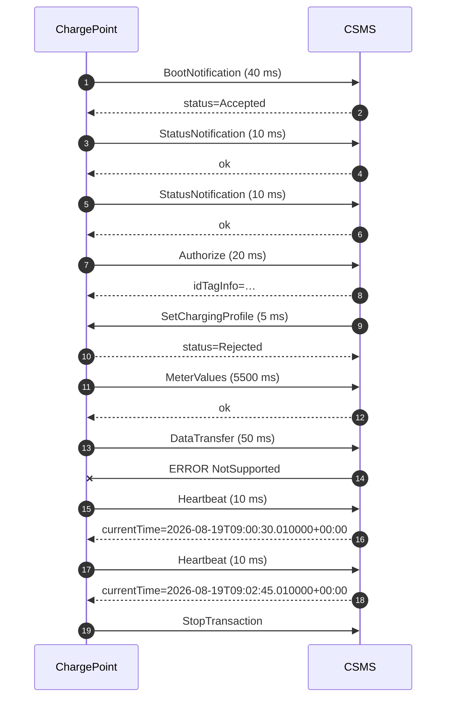

# Session report — `samples/ocpp_session_faulty.log`

## Summary / 摘要

| Metric | Value |
|---|---|
| Frames parsed / 解析帧数 | 19 |
| Requests / 请求数 | 10 |
| Duration / 时长 | 169.9 s |
| Errors / 错误 | 3 |
| Warnings / 警告 | 4 |

## Findings / 问题清单

| Rule | Severity | Line | Message |
|---|---|---|---|
| R006 | error | 9 | connector 1: illegal transition Available -> Charging |
| R003 | warning | 12 | response carries idTagInfo.status=Invalid |
| R003 | warning | 14 | response carries status=Rejected |
| R004 | warning | 15 | MeterValues took 5500 ms (> 2000 ms) |
| R002 | error | 18 | CALLERROR NotSupported: vendorId is not registered |
| R005 | warning | 21 | heartbeat gap of 135s (interval is 30s) |
| R001 | error | 23 | StopTransaction (uid=a9) was never answered |

## Timeline / 时间线

| # | Time | Dir | Message | Latency |
|---|---|---|---|---|
| 1 | +  0.00s | -> | BootNotification | 40 ms |
| 2 | +  0.04s | <- | CALLRESULT |  |
| 3 | +  0.05s | -> | StatusNotification | 10 ms |
| 4 | +  0.06s | <- | CALLRESULT |  |
| 5 | +  1.90s | -> | StatusNotification | 10 ms |
| 6 | +  1.91s | <- | CALLRESULT |  |
| 7 | +  2.90s | -> | Authorize | 20 ms |
| 8 | +  2.92s | <- | CALLRESULT |  |
| 9 | +  3.90s | <- | SetChargingProfile | 5 ms |
| 10 | +  3.90s | -> | CALLRESULT |  |
| 11 | +  5.90s | -> | MeterValues | 5500 ms |
| 12 | + 11.40s | <- | CALLRESULT |  |
| 13 | + 11.90s | -> | DataTransfer | 50 ms |
| 14 | + 11.95s | <- | CALLERROR |  |
| 15 | + 29.90s | -> | Heartbeat | 10 ms |
| 16 | + 29.91s | <- | CALLRESULT |  |
| 17 | +164.90s | -> | Heartbeat | 10 ms |
| 18 | +164.91s | <- | CALLRESULT |  |
| 19 | +169.90s | -> | StopTransaction |  |

## Sequence diagram / 时序图

