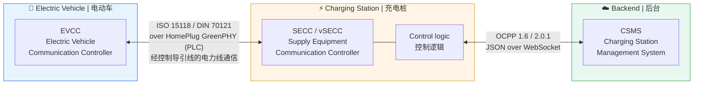

# EV Charging Lab
# 电动汽车充电实验室

Learning the EV charging stack from zero in two weeks — OCPP, ISO 15118, SECC
and Node-RED — by building four small things that work.
两周内从零学会电动汽车充电技术栈 —— OCPP、ISO 15118、SECC 和 Node-RED ——
方法是造四个真正能跑的小东西。

> **Started from zero.** In two weeks: from an OCPP hello-world, through a
> Node-RED test bench, to a protocol-agnostic session analyzer.
> **从零开始。** 两周: 从 OCPP hello-world，经 Node-RED 测试台架，
> 到一个与协议无关的会话分析器。

---

## The system in one picture / 一张图看懂整个系统



**The one thing to understand first / 首先要理解的一件事:**
the charging station plays two roles at once. To the car it is an **ISO 15118
server (SECC)**; to the backend it is an **OCPP client**. Everything else in
this repo follows from that.
充电桩同时扮演两个角色: 对车它是 **ISO 15118 服务端 (SECC)**，
对后台它是 **OCPP 客户端**。这个仓库里其他一切都由此展开。

**The question every interview asks / 每场面试都会问的问题:**
*"The grid can only give 50 kW. How does that number reach the car?"*
*"电网只能给 50 kW，这个数字怎么传到车上?"*

```
CSMS  --OCPP SetChargingProfile-->  station logic  --ISO 15118 CurrentDemandRes-->  car
                                          ↓
                            takes the minimum of: hardware rating,
                            cable rating, thermal derating, backend profile
                            取最小值: 硬件额定 / 线缆额定 / 温度降额 / 后台曲线
```

Project **01** implements the left half. Project **03** observes the right half.
项目 **01** 实现左半边，项目 **03** 观察右半边。

---

## The four projects / 四个项目

| # | Project | What it proves | 证明什么 | Status |
|---|---|---|---|---|
| **01** | [OCPP charge point + smart charging](01-ocpp-charge-point/) | You can implement a protocol, not just read about one | 你能实现协议而不只是读协议 | ✅ runs, 15 tests |
| **02** | [Node-RED mock CSMS + dashboard](02-node-red-flows/) | You can build the test tooling a team actually needs | 你能造出团队真正需要的测试工具 | ✅ runs, dashboard is TODO |
| **03** | [ISO 15118 session analysis](03-iso15118-analysis/) | You can read a protocol you had never seen | 你能读懂从没见过的协议 | 📝 do the work, fill the report |
| **04** | [V2G / OCPP log analyzer](04-v2g-log-analyzer/) | You can diagnose, which is the actual daily job | 你能做诊断 —— 这才是日常工作本身 | ✅ runs, 14 tests |

Each project's README has its own quick start, gotchas table, day-by-day
checklist, and interview talking points.
每个项目的 README 都有自己的快速开始、坑清单、逐日检查表和面试话术。

---

## 60-second demo / 60 秒演示

```bash
# 1. the backend
cd 01-ocpp-charge-point
python -m venv .venv && source .venv/bin/activate && pip install -r requirements.txt
python -m csms.central_system --port 9000 --push-profile-after 15 &

# 2. the station
python -m cp.charge_point --csms ws://localhost:9000 --id CP_1 --autostart 2

# watch for this line — it IS smart charging:
#   cp  t=34s  EV wants 32.0A, profile caps at 16.0A -> delivering 16.0A (3.68 kW)

# 3. analyse the session you just recorded
cd ../04-v2g-log-analyzer
python -m v2ganalyzer samples/ocpp_session_faulty.log
```

Everything runs on a laptop. No charging station, no car, no PLC modem.
一切都在笔记本上跑，不需要充电桩、车或 PLC 调制解调器。

---

## Two-week plan / 两周计划

| Day | Focus | 内容 | Deliverable / 产出 |
|---|---|---|---|
| **1** | Concepts + OCPP hello world | 概念 + OCPP 入门 | Can name every layer of the ISO 15118 stack |
| **2–4** | Project **01** | OCPP + SteVe + 智能充电 | A station that honours `SetChargingProfile` |
| **5–7** | Project **02** | Node-RED 仪表盘 | 📸 a dashboard screenshot |
| **8–12** | Projects **03** + **04** | ISO 15118 会话 + 日志分析 | 📄 a session analysis report |
| **13–14** | Write-up | 整理与讲述 | This README, polished, with images |

Full breakdown: [`docs/14-DAY-PLAN.md`](docs/14-DAY-PLAN.md)

### Progress / 进度

- [ ] Day 1 — concepts, OCPP hello world
- [ ] Day 2 — project 01 running end to end
- [ ] Day 3 — `profile.py` TODOs implemented, tests green
- [ ] Day 4 — SteVe integration + offline queueing
- [ ] Day 5 — Node-RED flow imported, station driven from it
- [ ] Day 6 — dashboard live at `/ui`
- [ ] Day 7 — automated bench scenario + 📸 screenshot
- [ ] Day 8 — ISO 15118 SECC + EVCC session completes
- [ ] Day 9 — pcap captured, one EXI message decoded by hand
- [ ] Day 10 — fault injected, log captured
- [ ] Day 11 — `v2g_text.py` parser written, R007/R008 implemented
- [ ] Day 12 — 📄 analysis report finished
- [ ] Day 13 — READMEs polished, screenshots in place
- [ ] Day 14 — talk through every project out loud, twice

---

## Documentation / 文档

| Doc | What |
|---|---|
| [`docs/GLOSSARY.md`](docs/GLOSSARY.md) | Every acronym in this repo, bilingual / 本仓库所有缩写，中英对照 |
| [`docs/14-DAY-PLAN.md`](docs/14-DAY-PLAN.md) | Day-by-day plan with checkboxes / 逐日计划与勾选项 |

---

## Screenshots / 截图

> Replace these once you have them. An interviewer opens images, not code.
> 有了之后替换掉。面试官会打开图片，不会打开代码。

| | |
|---|---|
| `02-node-red-flows/screenshots/dashboard.png` | Live charging dashboard |
| `02-node-red-flows/screenshots/flow.png` | The mock CSMS flow |
| `03-iso15118-analysis/captures/wireshark.png` | A V2G session in Wireshark |
| `04-v2g-log-analyzer/samples/report-example.md` | ✅ already generated |

---

## Open source used / 用到的开源项目

| Project | Role here |
|---|---|
| [mobilityhouse/ocpp](https://github.com/mobilityhouse/ocpp) | OCPP 1.6 / 2.0.1 / 2.1 Python library — project 01 |
| [steve-community/steve](https://github.com/steve-community/steve) | Real OCPP 1.6 CSMS with a web UI — project 01 |
| [citrineos/citrineos](https://github.com/citrineos/citrineos) | Open-source OCPP 2.0.1 CSMS |
| [thoughtworks/maeve-csms](https://github.com/thoughtworks/maeve-csms) | CSMS with ISO 15118 Plug & Charge |
| [SAP/e-mobility-charging-stations-simulator](https://github.com/SAP/e-mobility-charging-stations-simulator) | Scale-test with many stations |
| [EcoG-io/iso15118](https://github.com/EcoG-io/iso15118) | Python SECC + EVCC — project 03 |
| [EVerest/everest-core](https://github.com/EVerest/everest-core) | Industrial C++ charging stack |
| [EDF-Lab/eVDriveFlow](https://github.com/EDF-Lab/eVDriveFlow) | ISO 15118-20 / bidirectional charging |
| [uhi22/pyPLC](https://github.com/uhi22/pyPLC) | SLAC and the PLC physical layer — project 03 |
| [uhi22/OpenV2Gx](https://github.com/uhi22/OpenV2Gx) | Command-line EXI decoder — projects 03 + 04 |
| [Argonne-National-Laboratory/node-red-contrib-ocpp](https://github.com/Argonne-National-Laboratory/node-red-contrib-ocpp) | Ready-made OCPP nodes — project 02 |
| [juherr/awesome-ev-charging](https://github.com/juherr/awesome-ev-charging) | Index of everything else |

---

## Tests / 测试

```bash
cd 01-ocpp-charge-point && python -m unittest discover -s tests -v   # 15 passed
cd 04-v2g-log-analyzer  && python -m unittest discover -s tests -v   # 14 passed
```

`03` has no tests — it is a reading and writing project, on purpose.
`03` 没有测试 —— 它刻意是一个"读与写"的项目。
