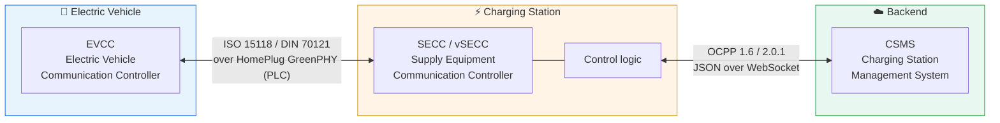

# EV Charging Lab

*[中文](README.zh-CN.md)*

Learning the EV charging stack from zero in two weeks — OCPP, ISO 15118, SECC
and Node-RED — by building four small things that work.

> **Started from zero.** In two weeks: from an OCPP hello-world, through a
> Node-RED test bench, to a protocol-agnostic session analyzer, to extending
> both protocols through their own designed extension points.

---

## The system in one picture



**The one thing to understand first:** the charging station plays two roles at
once. To the car it is an **ISO 15118 server (SECC)**; to the backend it is an
**OCPP client**. Everything else in this repo follows from that — including why
the two protocols disagree about almost every design decision.

**The question every interview asks:**
*"The grid can only give 50 kW. How does that number reach the car?"*

```
CSMS  --OCPP SetChargingProfile-->  station logic  --ISO 15118 ChargingStatusRes-->  car
                                          ↓
                            takes the minimum of: hardware rating,
                            cable rating, thermal derating, backend profile
```

Project **01** implements the left half. Project **03** observes the right half —
and found the two halves contradicting each other in a real stack.

---

## The four projects

| # | Project | What it proves | Status |
|---|---|---|---|
| **01** | [OCPP charge point + smart charging](01-ocpp-charge-point/) | You can implement a protocol, not just read about one | ✅ 44 tests, runs against SteVe |
| **02** | [Node-RED mock CSMS + dashboard](02-node-red-flows/) | You can build the test tooling a team actually needs | ✅ dashboard + one-button scenario |
| **03** | [ISO 15118 session analysis](03-iso15118-analysis/) | You can read a protocol you had never seen | ✅ 8-section report, 5 captures |
| **04** | [V2G / OCPP log analyzer](04-v2g-log-analyzer/) | You can diagnose, which is the actual daily job | ✅ 54 tests, 11 rules, HTML reports |

Each project's README has its own quick start, gotchas table and interview
talking points.

**Also published separately:**
[**wireshark-v2gtp-dissector**](https://github.com/Yihao23/wireshark-v2gtp-dissector)
— Wireshark ships no V2GTP dissector, so this repo grew one and it became its
own project.

---

## What the four projects found

Building them was the point; what they turned up is the part worth reading.

**A station advertising two incompatible power limits.** `ChargeParameterDiscoveryRes`
carries `PMax` in the `SAScheduleList` and `EVSEMaxCurrent` in
`AC_EVSEChargeParameter`, ISO 15118-2 sets no precedence between them, and the
stack under test had them disagree by a factor of two. Dropping the station's
offer to 5 A — below the car's own stated minimum — changed the car's behaviour
not at all: byte-for-byte the same request for 11 kW. It never reads the field.
[Report §4–5](03-iso15118-analysis/report/REPORT-01.md).

**A framing bug that a quiet lab link hides.** The stack reads a fixed 7000-byte
buffer instead of honouring V2GTP's length field. Every message in the capture
fits in one TCP segment, so it works — until the link is slower or the messages
bigger. The Wireshark dissector flags the mismatch when it happens.

**Four reconnect bugs found by pulling the plug**, none of which 44 unit tests
caught: a boot notification reporting `Available` mid-charge, metering silently
stopping during an outage, an orphaned task double-billing, and a crash on the
CSMS restarting. [Project 01](01-ocpp-charge-point/).

---

## Extending a protocol without breaking it

The same four fields a bus depot needs — bay, vehicle, departure time, target
charge — sent over both protocols, through the extension point each one
designed for the purpose. Neither protocol should carry these natively: the
departure time comes from the operator's scheduling system, and a standard used
by hundreds of millions of passenger cars has no business defining a field a few
thousand depots need.

| | OCPP `DataTransfer` | ISO 15118 `ParameterSet` |
|---|---|---|
| On the wire | `"data": "{\"slot\": 7, ...}"` | `{"Name":"DepotSlot","intValue":7}` |
| Typing | none — JSON inside JSON | `intValue` / `stringValue` / `byteValue` |
| Peer can validate | ❌ | ✅ the XSD does it |
| Peer can discover | ❌ agree the vendorId out of band | ✅ `ServiceDiscovery` lists it |
| TLS required | ❌ | ✅ [V2G2-422] |
| Refusal | four status codes | `FAILED_ServiceIDInvalid` |

**ISO 15118 cannot take a new field at all.** The XSD is normative and EXI is
schema-informed, so a field is not a name on the wire but a position — insert
one element and every subsequent bit shifts. The peer does not ignore an unknown
field the way a JSON parser would; it decodes garbage from that bit onward. The
sanctioned route is a value-added service, and the standard reserved the slot
itself: `ServiceCategory.OtherCustom`.

OCPP connects a station to a backend that usually belongs to the same company,
so an opaque blob both sides agreed on privately costs nothing. ISO 15118
connects any car to any station, parties that have never spoken, so an extension
has to be announced, typed and safely ignorable.

[Project 01](01-ocpp-charge-point/) · [Report §7](03-iso15118-analysis/report/REPORT-01.md)

---

## 60-second demo

```bash
# 1. the backend
cd 01-ocpp-charge-point
python -m venv .venv && source .venv/bin/activate && pip install -r requirements.txt
python -m csms.central_system --port 9000 --push-profile-after 15 &

# 2. the station
python -m cp.charge_point --csms ws://localhost:9000 --id CP_1 --autostart 2

# watch for this line — it IS smart charging:
#   cp  t=34s  EV wants 32.0A, profile caps at 16.0A -> delivering 16.0A (3.68 kW)

# 3. analyse the session you just recorded
cd ../04-v2g-log-analyzer
python -m v2ganalyzer samples/ocpp_session_faulty.log
python -m v2ganalyzer samples/ocpp_session.log --format html -o report.html
```

Everything runs on a laptop. No charging station, no car, no PLC modem.

---

## Documentation

| Doc | What |
|---|---|
| [`03-iso15118-analysis/report/REPORT-01.md`](03-iso15118-analysis/report/REPORT-01.md) | The session analysis, eight sections, written from captures in this repo |
| [`04-v2g-log-analyzer/samples/`](04-v2g-log-analyzer/samples/) | Generated reports, Markdown and HTML, one with an SVG power plot |
| [`docs/GLOSSARY.md`](docs/GLOSSARY.md) | Every acronym in this repo |
| [`docs/14-DAY-PLAN.md`](docs/14-DAY-PLAN.md) | The plan this was built to |

---

## Screenshots

The station in this repo, driven by [SteVe](https://github.com/steve-community/steve)
— an open-source OCPP 1.6 CSMS in production use since 2013.


A transaction started from SteVe's web UI: 1686 Wh over 14 minutes, opened and
closed by `RemoteStartTransaction` / `RemoteStopTransaction`.

| Image | What it shows |
|---|---|
| [`steve-transaction.png`](01-ocpp-charge-point/screenshots/steve-transaction.png) | ⭐ The completed transaction, start to stop |
| [`steve-chargepoint-details.png`](01-ocpp-charge-point/screenshots/steve-chargepoint-details.png) | The vendor / model / firmware strings this code sends in `BootNotification`, stored by SteVe |
| [`steve-dashboard.png`](01-ocpp-charge-point/screenshots/steve-dashboard.png) | SteVe's dashboard mid-charge |
| [`steve-connected.png`](01-ocpp-charge-point/screenshots/steve-connected.png) | The OCPP 1.6-J WebSocket session, live |
| [`steve-connector-status.png`](01-ocpp-charge-point/screenshots/steve-connector-status.png) | Connector back to `Available` after the stop |


The same station seen through a Node-RED bench dashboard. The notch in the power
trace is the backend curtailing the station and releasing it again —
`SetChargingProfile` arriving, the station obeying, and recovering.

---

## Open source used

| Project | Role here |
|---|---|
| [mobilityhouse/ocpp](https://github.com/mobilityhouse/ocpp) | OCPP 1.6 / 2.0.1 / 2.1 Python library — project 01 |
| [steve-community/steve](https://github.com/steve-community/steve) | Real OCPP 1.6 CSMS with a web UI — project 01 |
| [EcoG-io/iso15118](https://github.com/EcoG-io/iso15118) | Python SECC + EVCC — project 03 |
| [uhi22/OpenV2Gx](https://github.com/uhi22/OpenV2Gx) | Command-line EXI decoder — projects 03 + 04 |
| [uhi22/pyPLC](https://github.com/uhi22/pyPLC) | SLAC and the PLC physical layer |
| [EVerest/everest-core](https://github.com/EVerest/everest-core) | Industrial C++ charging stack |
| [citrineos/citrineos](https://github.com/citrineos/citrineos) | Open-source OCPP 2.0.1 CSMS |
| [thoughtworks/maeve-csms](https://github.com/thoughtworks/maeve-csms) | CSMS with ISO 15118 Plug & Charge |
| [SAP/e-mobility-charging-stations-simulator](https://github.com/SAP/e-mobility-charging-stations-simulator) | Scale-test with many stations |
| [EDF-Lab/eVDriveFlow](https://github.com/EDF-Lab/eVDriveFlow) | ISO 15118-20 / bidirectional charging |
| [Argonne-National-Laboratory/node-red-contrib-ocpp](https://github.com/Argonne-National-Laboratory/node-red-contrib-ocpp) | Ready-made OCPP nodes — project 02 |
| [juherr/awesome-ev-charging](https://github.com/juherr/awesome-ev-charging) | Index of everything else |

---

## Tests

```bash
cd 01-ocpp-charge-point && python -m unittest discover -s tests   # 44 passed
cd 04-v2g-log-analyzer  && python -m unittest discover -s tests   # 54 passed
```

Project 04 is standard-library only, on purpose: a diagnostic tool is worth more
if it runs on a station's embedded Linux without a package manager.

`03` has no tests — it is a reading and writing project, and its output is the
report.
