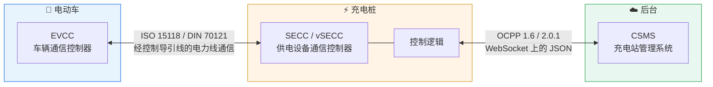
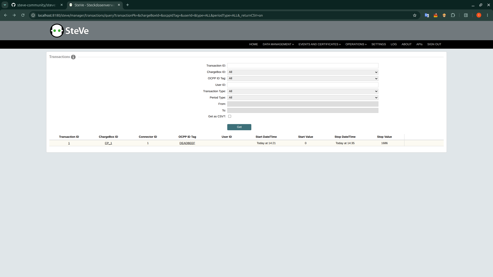
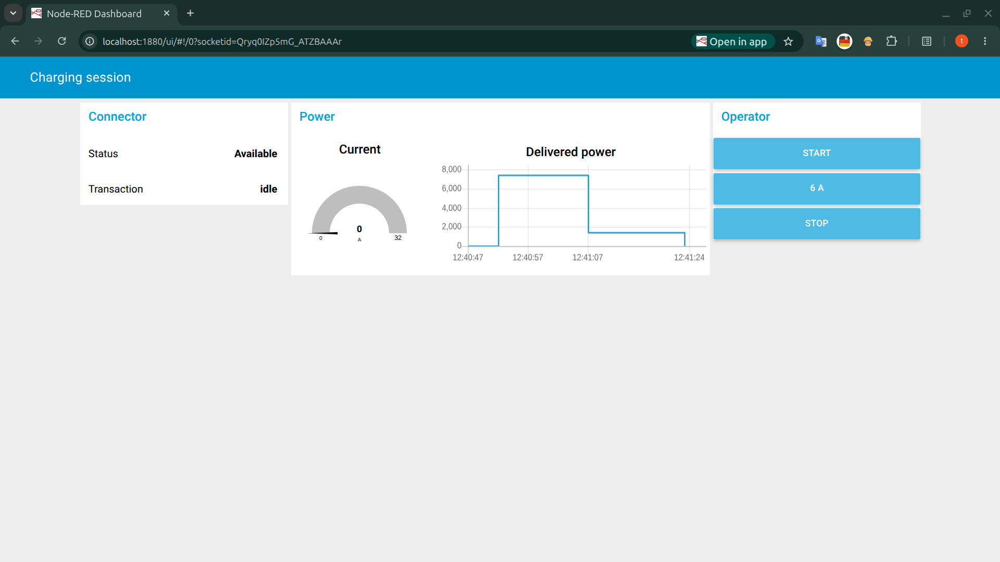

# 电动汽车充电实验室

*[English](README.md)*

两周内从零学会电动汽车充电技术栈 —— OCPP、ISO 15118、SECC 和 Node-RED ——
方法是造四个真正能跑的小东西。

> **从零开始。** 两周: 从 OCPP hello-world，经 Node-RED 测试台架，
> 到一个与协议无关的会话分析器，最后用两个协议各自设计好的扩展点去扩展它们。

---

## 一张图看懂整个系统



**首先要理解的一件事:** 充电桩同时扮演两个角色。对车它是
**ISO 15118 服务端 (SECC)**，对后台它是 **OCPP 客户端**。这个仓库里其他一切都由此
展开 —— 包括为什么两个协议在几乎每一个设计决定上都不一样。

**每场面试都会问的问题:**
*"电网只能给 50 kW，这个数字怎么传到车上?"*

```
CSMS  --OCPP SetChargingProfile-->  桩的控制逻辑  --ISO 15118 ChargingStatusRes-->  车
                                          ↓
                            取最小值: 硬件额定 / 线缆额定
                                     / 温度降额 / 后台曲线
```

项目 **01** 实现左半边，项目 **03** 观察右半边 —— 而且在一个真实协议栈里发现了
这两半互相矛盾。

---

## 四个项目

| # | 项目 | 证明什么 | 状态 |
|---|---|---|---|
| **01** | [OCPP 充电桩 + 智能充电](01-ocpp-charge-point/) | 你能实现协议，而不只是读协议 | ✅ 44 个测试，能对接 SteVe |
| **02** | [Node-RED 模拟后台 + 仪表盘](02-node-red-flows/) | 你能造出团队真正需要的测试工具 | ✅ 仪表盘 + 一键测试场景 |
| **03** | [ISO 15118 会话分析](03-iso15118-analysis/) | 你能读懂从没见过的协议 | ✅ 八节报告，五份抓包 |
| **04** | [V2G / OCPP 日志分析器](04-v2g-log-analyzer/) | 你能做诊断 —— 这才是日常工作本身 | ✅ 54 个测试，11 条规则，HTML 报告 |

每个项目的 README 都有自己的快速开始、坑清单和面试话术。

**另外单独发布的:**
[**wireshark-v2gtp-dissector**](https://github.com/Yihao23/wireshark-v2gtp-dissector)
—— Wireshark 没有内置 V2GTP 解析器，这个仓库里长出来一个，后来独立成了一个项目。

---

## 四个项目发现了什么

造出来只是过程，查出来的东西才值得读。

**一台桩同时报出两个互不兼容的功率上限。** `ChargeParameterDiscoveryRes` 里，
`PMax` 在 `SAScheduleList` 中、`EVSEMaxCurrent` 在 `AC_EVSEChargeParameter` 中，
ISO 15118-2 没有规定谁优先，而被测协议栈里这两个数差了一倍。把桩报的电流压到
5 A —— 低于车自己声明的最小值 —— 车的行为一点没变: 逐字节相同的 11 kW 请求。
**它根本不读那个字段。**
[报告第 4–5 节](03-iso15118-analysis/report/REPORT-01.md)

**一个被安静链路掩盖的分帧 bug。** 协议栈读一个固定 7000 字节的缓冲区，
而不按 V2GTP 的长度字段分帧。抓包里每条消息都恰好装在一个 TCP 段里，所以它能跑 ——
直到链路变慢或消息变大。Wireshark 解析器会在真的发生时标出来。

**四个拔网线才发现的重连 bug**，44 个单元测试一个都没抓到: 充电中途报
`Available`、断网期间计量静默停止、孤儿任务导致重复计费、后台重启时进程崩溃。
[项目 01](01-ocpp-charge-point/)

---

## 在不破坏协议的前提下扩展它

公交场站需要的同样四个字段 —— 车位、车辆、发车时间、目标电量 —— 在两个协议里
各发了一遍，走的都是它们各自为此设计的扩展点。两个协议都不该原生携带这些:
发车时间来自运营方的排班系统，而一个服务几亿辆乘用车的标准，不该为几千个场站
定义字段。

| | OCPP `DataTransfer` | ISO 15118 `ParameterSet` |
|---|---|---|
| 线路上的样子 | `"data": "{\"slot\": 7, ...}"` | `{"Name":"DepotSlot","intValue":7}` |
| 类型 | 无 —— JSON 套 JSON | `intValue` / `stringValue` / `byteValue` |
| 对端能校验吗 | ❌ | ✅ XSD 保证 |
| 对端能发现吗 | ❌ 得线下约定 vendorId | ✅ `ServiceDiscovery` 会列出来 |
| 要 TLS 吗 | ❌ | ✅ [V2G2-422] |
| 拒绝方式 | 四个状态码 | `FAILED_ServiceIDInvalid` |

**ISO 15118 根本加不了字段。** XSD 是规范性的，EXI 又是 schema-informed ——
字段在线路上不是一个名字，是一个位置，插入一个元素之后每一位都错位。对端不会像
JSON 解析器那样忽略不认识的字段，而是从那一位起解出乱码。官方路线是增值服务，
而且标准自己留好了槽: `ServiceCategory.OtherCustom`。

OCPP 连接的桩和后台通常同属一家公司，所以一个双方私下约定的不透明字符串没什么
代价。ISO 15118 连接的是任意车和任意桩 —— 两个素未谋面的参与方 ——
所以扩展必须能被告知、有类型、且能被安全忽略。

[项目 01](01-ocpp-charge-point/) · [报告第 7 节](03-iso15118-analysis/report/REPORT-01.md)

---

## 60 秒演示

```bash
# 1. 后台
cd 01-ocpp-charge-point
python -m venv .venv && source .venv/bin/activate && pip install -r requirements.txt
python -m csms.central_system --port 9000 --push-profile-after 15 &

# 2. 桩
python -m cp.charge_point --csms ws://localhost:9000 --id CP_1 --autostart 2

# 盯住这一行 —— 这就是智能充电:
#   cp  t=34s  EV wants 32.0A, profile caps at 16.0A -> delivering 16.0A (3.68 kW)

# 3. 分析刚刚录下的会话
cd ../04-v2g-log-analyzer
python -m v2ganalyzer samples/ocpp_session_faulty.log
python -m v2ganalyzer samples/ocpp_session.log --format html -o report.html
```

一切都在笔记本上跑，不需要充电桩、车或 PLC 调制解调器。

---

## 文档

| 文档 | 内容 |
|---|---|
| [`03-iso15118-analysis/report/REPORT-01.md`](03-iso15118-analysis/report/REPORT-01.md) | 会话分析报告，八节，全部基于本仓库里的抓包 |
| [`04-v2g-log-analyzer/samples/`](04-v2g-log-analyzer/samples/) | 生成的报告，Markdown 和 HTML，其中一份带 SVG 功率曲线 |
| [`docs/GLOSSARY.md`](docs/GLOSSARY.md) | 本仓库所有缩写 |
| [`docs/14-DAY-PLAN.md`](docs/14-DAY-PLAN.md) | 当初照着做的那份计划 |

---

## 截图

本仓库的充电桩，由 [SteVe](https://github.com/steve-community/steve) 驱动 ——
一个 2013 年至今仍在生产使用的开源 OCPP 1.6 后台。



从 SteVe 的 Web 界面发起的一次事务: 14 分钟 1686 Wh，由远程启停指令开始和结束。

| 图 | 说明 |
|---|---|
| [`steve-transaction.png`](01-ocpp-charge-point/screenshots/steve-transaction.png) | ⭐ 完整的事务记录，从开始到结束 |
| [`steve-chargepoint-details.png`](01-ocpp-charge-point/screenshots/steve-chargepoint-details.png) | 代码里写在 `BootNotification` 的厂商/型号/固件，一路存进 SteVe |
| [`steve-dashboard.png`](01-ocpp-charge-point/screenshots/steve-dashboard.png) | 充电中的后台总览 |
| [`steve-connected.png`](01-ocpp-charge-point/screenshots/steve-connected.png) | 实时的 OCPP 1.6-J WebSocket 连接 |
| [`steve-connector-status.png`](01-ocpp-charge-point/screenshots/steve-connector-status.png) | 停止后接口回到 `Available` |



同一台桩在 Node-RED 台架仪表盘里的样子。功率曲线上的凹槽就是后台限功率再放开 ——
`SetChargingProfile` 到达、桩照做、然后恢复。

---

## 用到的开源项目

| 项目 | 在这里的作用 |
|---|---|
| [mobilityhouse/ocpp](https://github.com/mobilityhouse/ocpp) | OCPP 1.6 / 2.0.1 / 2.1 的 Python 库 —— 项目 01 |
| [steve-community/steve](https://github.com/steve-community/steve) | 带 Web 界面的真实 OCPP 1.6 后台 —— 项目 01 |
| [EcoG-io/iso15118](https://github.com/EcoG-io/iso15118) | Python 实现的 SECC + EVCC —— 项目 03 |
| [uhi22/OpenV2Gx](https://github.com/uhi22/OpenV2Gx) | 命令行 EXI 解码器 —— 项目 03 + 04 |
| [uhi22/pyPLC](https://github.com/uhi22/pyPLC) | SLAC 与 PLC 物理层 |
| [EVerest/everest-core](https://github.com/EVerest/everest-core) | 工业级 C++ 充电栈 |
| [citrineos/citrineos](https://github.com/citrineos/citrineos) | 开源 OCPP 2.0.1 后台 |
| [thoughtworks/maeve-csms](https://github.com/thoughtworks/maeve-csms) | 带 ISO 15118 Plug & Charge 的后台 |
| [SAP/e-mobility-charging-stations-simulator](https://github.com/SAP/e-mobility-charging-stations-simulator) | 多桩规模测试 |
| [EDF-Lab/eVDriveFlow](https://github.com/EDF-Lab/eVDriveFlow) | ISO 15118-20 / 双向充电 |
| [Argonne-National-Laboratory/node-red-contrib-ocpp](https://github.com/Argonne-National-Laboratory/node-red-contrib-ocpp) | 现成的 OCPP 节点 —— 项目 02 |
| [juherr/awesome-ev-charging](https://github.com/juherr/awesome-ev-charging) | 其余一切的索引 |

---

## 测试

```bash
cd 01-ocpp-charge-point && python -m unittest discover -s tests   # 44 通过
cd 04-v2g-log-analyzer  && python -m unittest discover -s tests   # 54 通过
```

项目 04 刻意只用标准库: 一个诊断工具，如果能在桩的嵌入式 Linux 上、
没有包管理器的情况下跑起来，价值高得多。

`03` 没有测试 —— 它是一个"读与写"的项目，产出就是那份报告。
